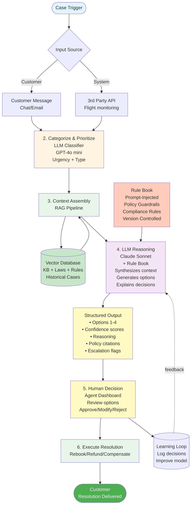

# Agentic Flow v1

*High-level overview of the agent-assisted CS resolution system flow*

---

## System Flow Overview

This diagram shows the end-to-end flow of how cases are processed, from initial trigger through to customer resolution.

---

## Flow Steps

1. **Case Trigger**: Event originates from either customer contact (chat/email) or proactive detection via 3rd party flight status APIs

2. **Categorize & Prioritize**: Fast LLM (GPT-4o mini) classifies the issue type and calculates urgency based on time-to-departure and customer location

3. **Context Assembly**: RAG pipeline retrieves relevant information:
   - Booking details
   - Flight status
   - Policies from knowledge base
   - Laws and regulations
   - Similar historical cases

4. **LLM Reasoning (with Rule Book)**: Claude Sonnet receives:
   - **Prompt-injected rule book** (policies, compliance rules, guardrails)
   - Context from RAG pipeline
   - Case details and urgency
   
   Generates **structured output** with:
   - 2-4 valid resolution options
   - **Confidence scores per option** (0-100%)
   - **Policy citations** (which rules apply)
   - **Reasoning explanation** (why each option is valid/best)
   - **Uncertainty flags** (missing data, edge cases)
   - **Escalation triggers** (when to involve supervisor)

5. **Human Decision**: Agent reviews structured output in dashboard:
   - Sees all context and LLM reasoning
   - Can approve, modify, or reject options
   - Makes final decision (human-in-the-loop for MVP)

6. **Execute Resolution**: Approved option is executed:
   - Rebooking via airline APIs
   - Refund processing
   - Compensation/vouchers
   - Customer notification

**Learning Loop**: All decisions are logged and outcomes tracked to continuously improve the model.

---

*Version 1.0 - January 2026*

