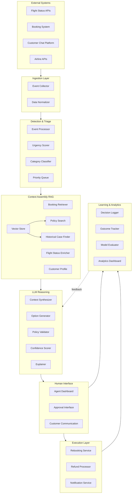
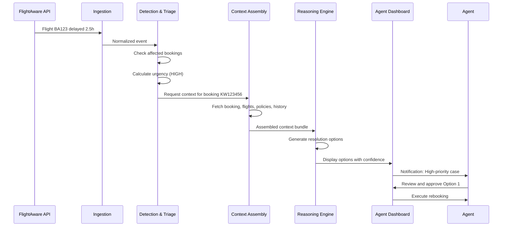
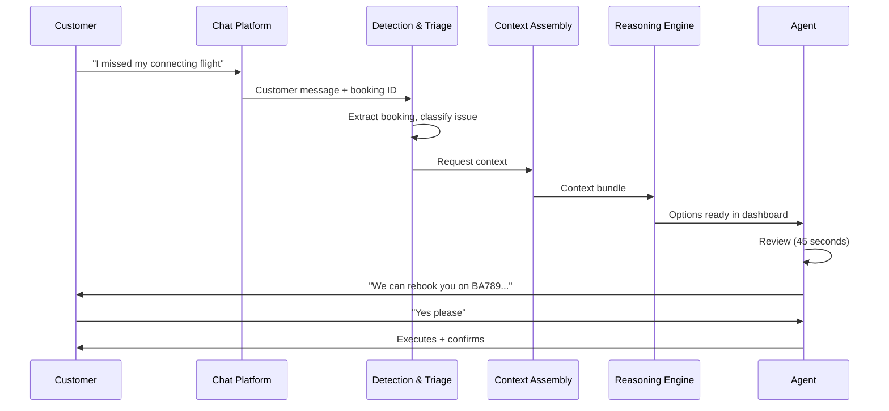

# System Design: Agent-Assisted CS Resolution System

*Agent-assisted customer support system for virtual interlining failure resolution at Pineapple Travel*

---

## Table of Contents
1. [Overview](#overview)
2. [System Architecture](#system-architecture)
3. [Component Details](#component-details)
4. [Data Flows](#data-flows)
5. [Integration Points](#integration-points)
6. [Error Handling](#error-handling)
7. [Scalability Considerations](#scalability-considerations)

---

## Overview

### Problem Statement
Pineapple Travel's virtual interlining creates complex failure scenarios (missed connections, schedule changes) where:
- No single airline owns the problem
- Responsibility is ambiguous
- Resolutions are inconsistent and slow
- Support agents lack context and decision support

### Solution
An LLM-powered agent-assistance system that:
- Detects failures proactively or via customer contact
- Gathers all relevant context automatically
- Generates valid resolution options with explanations
- Requires human approval for all MVP decisions
- Creates audit trail for learning and compliance

### Key Principles
1. **Human augmentation, not replacement**
2. **Urgency-based prioritisation** (not category-based)
3. **Explainability by default**
4. **Conservative start, gradual autonomy**
5. **Continuous learning from human decisions**
6. **Built to scale and reuse** (platform architecture)

### System Flow Overview

This diagram shows the end-to-end flow from case trigger through customer resolution:

**Flow Steps:**
1. **Case Trigger** → Customer message or 3rd party API (flight status)
2. **Categorize** → LLM classifies issue type and urgency
3. **Context Assembly** → RAG retrieves:
   - Booking details from Booking Database (verify claim legitimacy)
   - Flight status cross-referenced with bookings (validate delays/cancellations)
   - Policies, laws, historical cases from vector DB
4. **LLM Reasoning** → Claude Sonnet receives prompt-injected rule book + context, generates resolution options with explanations
5. **Structured Output** → Formatted options with confidence scores, policy citations, reasoning, escalation flags
6. **Human Decision** → Agent reviews structured output and approves/modifies/rejects
7. **Execute** → Resolution delivered to customer
8. **Learning Loop** → Decisions logged to improve model

---

## System Architecture

### High-Level Architecture

### Prototype Technology Stack

*Note: This section describes the minimal technology stack for building a working prototype/demo. In production, all technology decisions would be made by the engineering team based on scale, performance, and infrastructure requirements.*

| Component | Technology | Rationale |
|-----------|-----------|-----------|
| **Orchestration** | LangFlow | Visual pipeline building, rapid prototyping (demo only) |
| **Vector Store** | ChromaDB | Simple, local-first, easy setup for prototype |
| **Embeddings** | OpenAI text-embedding-3-small | API-based, no infrastructure needed |
| **Fast LLM** | GPT-4o mini | Speed + cost for classification |
| **Reasoning LLM** | Claude 3.5 Sonnet | Best reasoning quality + explainability |
| **Rule Book** | Markdown + Git | Version controlled, auditable, fast iteration |

*For prototype: No backend/frontend framework, database, queue, or monitoring infrastructure needed. Simple Python scripts and LangFlow UI sufficient to demonstrate core concepts.*

---

## Component Details

*Note: This section outlines the conceptual components and their purpose. Technical implementation details would be determined by the engineering team.*

### 1. Event Detection & Intake

**What it does**: Captures disruption signals from multiple sources and determines what needs attention

**Key Sources**:
- Flight status APIs (proactive detection before customer knows)
- Customer-initiated contact (reactive - they're already aware)
- Booking system changes (schedule updates, cancellations)

**Critical Decision**: How do we prioritise?
- **Urgency-based**, not first-come-first-served
- Factors: Time to departure, customer location, booking value, guarantee status
- Critical (in-airport) cases surface immediately; future issues can wait

**Why this matters**: Customers in airports need responses in minutes, not hours. The system must understand context to prioritise appropriately.

---

### 2. Context Assembly & Verification

**What it does**: Gathers everything an agent needs to make an informed decision, automatically

**What gets pulled together**:
- **Booking verification**: Does this booking exist? Does the customer have standing?
- **Flight status**: Real-time data on delays, cancellations, alternatives
- **Policy lookup**: Which rules apply? Guarantee coverage, refund eligibility, EU261 rights
- **Historical cases**: How have we resolved similar situations before?
- **Customer context**: Tier, previous issues, lifetime value

**Critical Decision**: Cross-reference flight status with bookings
- Enables proactive detection: "Flight BA123 delayed → which of our customers are affected?"
- Prevents fraud: Verify claims match actual bookings
- Provides complete picture: Don't just trust what customer says, validate

**Why this matters**: Agents typically hunt for information across multiple systems (bookings, flight status, policies, history). Automating context assembly could significantly reduce TTFR and ensure nothing is missed.

---

### 3. Intelligent Resolution Generation

**What it does**: Uses LLM to generate 2-4 valid resolution options with clear reasoning

**How it works** (conceptually):
1. **Rule book**: Policies injected into LLM prompt (version controlled, easy to update)
2. **Context synthesis**: LLM reviews all assembled information
3. **Option generation**: Creates multiple valid solutions ranked by customer satisfaction, policy compliance, cost
4. **Explainability**: Cites which rules apply, why each option is valid

**Structured Output Includes**:
- Resolution options (what to do)
- Confidence scores (how certain is the LLM?)
- Policy citations (which rules were applied)
- Reasoning (why this option makes sense)
- Uncertainty flags (missing data or edge cases)
- Escalation triggers (when human judgment is needed)

**Critical Decision**: Prompt-injected rules vs hard-coded logic
- **Choice**: Prompt injection (rules as text in the prompt)
- **Why**: Faster iteration, easy to audit, no code changes for policy updates
- **Trade-off**: Slightly less enforcement guarantee than hard-coded, but massively more flexible

**Why this matters**: Agents need to review options quickly and confidently. Clear structure + reasoning = fast decisions. Confidence scores signal when to trust vs scrutinise.

---

### 4. Human Review & Decision

**What it does**: Presents options to agent for review, approval, or modification

**Agent sees**:
- All context that was assembled (booking, flight status, policies, history)
- LLM-generated resolution options with explanations
- Confidence indicators (🟢 high, 🟡 medium, 🔴 low)
- Ability to approve, modify, or reject any option

**Critical Decision**: 100% human-in-the-loop for MVP
- **Why**: Build trust, collect training data, prove value before considering automation
- **Future**: High-confidence cases could be auto-executed after validation period

**Why this matters**: Agents are the customer champions. The system augments their judgment, doesn't replace it. They always have final say.

---

### 5. Execution & Learning

**What it does**: Executes approved resolutions and logs everything for continuous improvement

**Execution**: 
- Rebooking through airline APIs
- Refund processing
- Customer notifications (SMS, email)
- Track completion and customer response

**Learning Loop**:
- Log every decision: what LLM suggested, what agent chose, what outcome resulted
- Track metrics: approval rates, confidence calibration, cost accuracy, customer satisfaction
- Generate insights: Improve prompts, identify patterns, refine rules
- Close the loop: Better suggestions over time

**Why this matters**: Every interaction is training data. The system gets smarter by learning from agent decisions and customer outcomes.

---

## Key Design Principles

1. **Graceful degradation**: If any component fails, agent can still work (system doesn't block humans)
2. **Transparency**: Agent sees everything the system sees
3. **Auditability**: Every decision logged with full context
4. **Composability**: Components can be reused for other use cases (customer-facing apps, different channels)

---
## Data Flows

### Flow 1: Proactive Detection (Flight Delay)

**Latency**:
- Detection: <1 second
- Context assembly: <1 second
- LLM reasoning: <3 seconds
- **Total: <5 seconds** from event to agent notification

### Flow 2: Customer-Initiated Contact

**Target Experience**:
- Customer wait time: Near-instant for first response template
- Agent decision time: Significantly faster with pre-assembled context
- **Goal**: Dramatic reduction in TTFR through automated context assembly

---

## Integration Points

### External APIs

| System | Purpose | Protocol | SLA |
|--------|---------|----------|-----|
| FlightAware | Real-time flight status | REST API | 99.9% uptime |
| Pineapple Travel Booking System | Booking data, modifications | Internal API | 99.95% uptime |
| Airline APIs | Rebooking, availability | REST/SOAP | Varies by airline |
| Payment Gateway | Refund processing | REST API | 99.9% uptime |
| Customer Service Platform | Chat, email, SMS | Webhooks + API | 99.5% uptime |

### Authentication & Security
- API keys rotated monthly
- All customer data encrypted at rest and in transit
- PCI DSS compliance for payment data
- GDPR compliance for EU customers
- Role-based access control (RBAC) for agents

---

## Error Handling

### LLM Failures

**Failure Modes**:
1. **Timeout** (>10s response)
   - Retry once
   - If fails again: Escalate to human without suggestions
   
2. **Invalid JSON** (parsing error)
   - Log error with full context
   - Retry with simplified prompt
   - If fails: Escalate to human

3. **Policy Violation** (validator rejects)
   - Log violation details
   - Request alternative from LLM
   - If persistent: Escalate to human

4. **Hallucination** (suggests impossible option)
   - Feasibility validator catches
   - Log for model improvement
   - Filter out invalid option
   - If no valid options: Escalate

**Fallback Strategy**:
- Always degrade gracefully to human-only mode
- Agent sees all context even if LLM fails
- System never blocks human from working

### Integration Failures

**Booking System Down**:
- Queue cases until system recovers
- Prioritise by urgency when back online
- Manual workaround: Agent can enter data manually

**Flight API Down**:
- Use cached flight data (if recent)
- Display "Data may be stale" warning
- Agent can manually verify

---

## Scalability Considerations

### Current MVP Scale
- 100 cases/day
- 5 concurrent agents
- <$100/day in LLM costs

### Growth Path
| Metric | Phase 1 | Phase 2 | Phase 3 |
|--------|---------|---------|---------|
| Cases/day | 100 | 1,000 | 10,000 |
| Agents | 5 | 50 | 200 |
| Response time | <5s | <3s | <2s |
| LLM cost/case | $0.05 | $0.03 | $0.01 |

### Bottlenecks & Mitigations

**LLM API rate limits**:
- Cache repeated queries
- Batch non-urgent cases
- Self-hosted open-source models for classification

**Vector search at scale**:
- Shard by region/time
- Approximate nearest neighbor (ANN)
- Separate hot/cold data

**Database writes (decision logs)**:
- Async logging (don't block agent)
- Batch writes
- Time-series database for analytics

---

## Monitoring & Observability

### Key Metrics

**System Health**:
- Latency (p50, p95, p99) for each component
- Error rates (LLM failures, API timeouts)
- Queue depth and wait time

**Business Metrics**:
- Time to First Resolution (TTFR)
- Agent approval rate
- Customer CSAT (per resolution type)
- Cost per resolution
- Repeat contact rate

**ML Metrics**:
- Confidence calibration
- Hallucination rate
- Policy compliance rate
- Similar case retrieval accuracy

### Alerts

**Critical** (page on-call):
- System down >5 minutes
- Error rate >10%
- High-urgency cases waiting >10 minutes

**Warning** (email team):
- Agent approval rate drops below 70%
- LLM latency p95 >5 seconds
- Cost per case exceeds budget by 20%

---

## Security & Compliance

### Data Privacy
- Customer PII encrypted at rest (AES-256)
- PII redacted from LLM prompts where possible
- Audit log of all PII access
- Right to deletion supported (GDPR)

### Compliance
- **EU261**: System enforces passenger rights
- **PCI DSS**: Payment data handling compliant
- **GDPR**: Data minimization, consent tracking
- **Internal**: All decisions auditable

### Access Control
- Agents: Read access to assigned cases only
- Senior agents: Can override system recommendations
- Managers: Full audit log access
- Engineers: Anonymized data only for model improvement

---

## Future Enhancements

### Phase 2: Selective Autonomy
- Auto-execute high-confidence (>0.95) rebookings after customer approval
- Proactive customer communication ("We've found an alternative...")
- Predictive rebooking (before customer notices issue)

### Phase 3: Advanced Features
- Multi-language support (translate policies, generate responses)
- Sentiment analysis for escalation (detect frustrated customers)
- Personalization (learn customer preferences)
- Predictive analytics (identify failure-prone itineraries at booking time)

### Phase 4: Ecosystem Integration
- Share resolution patterns with airline partners
- Industry-wide knowledge base (anonymized)
- API for third-party travel insurance providers

