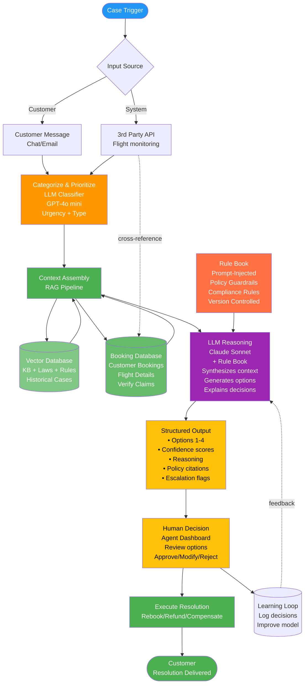
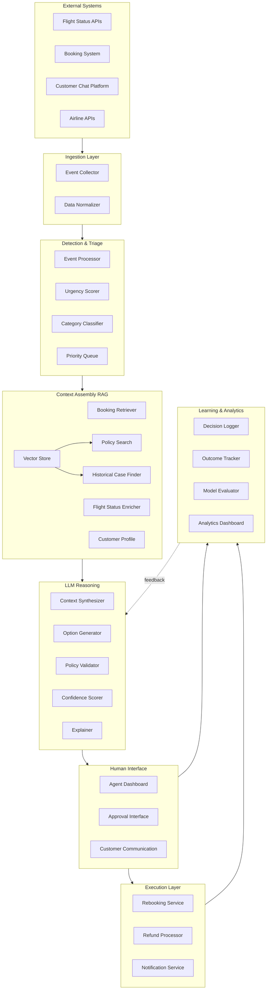
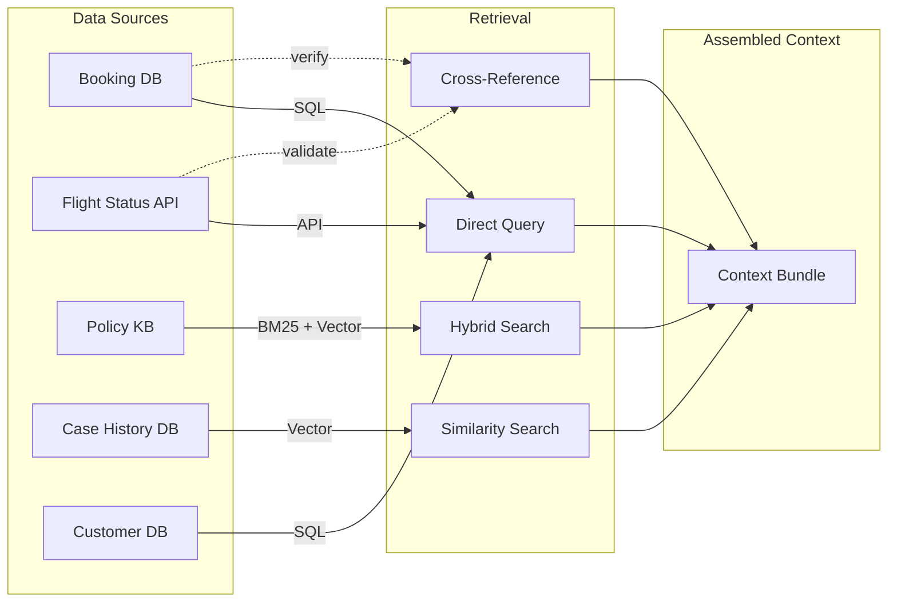
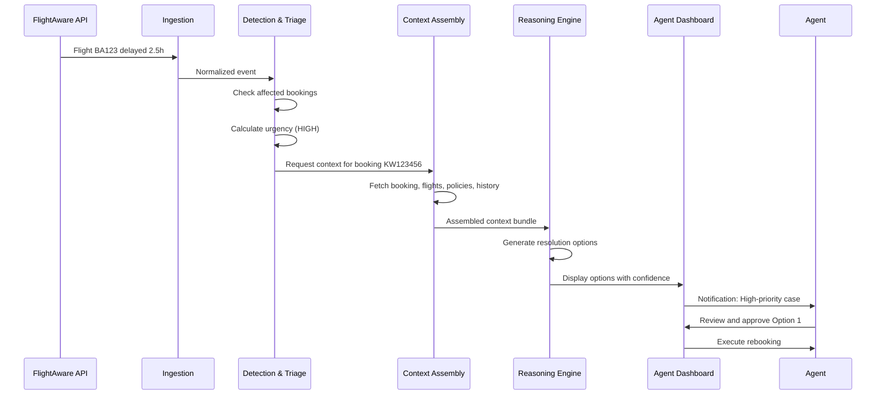
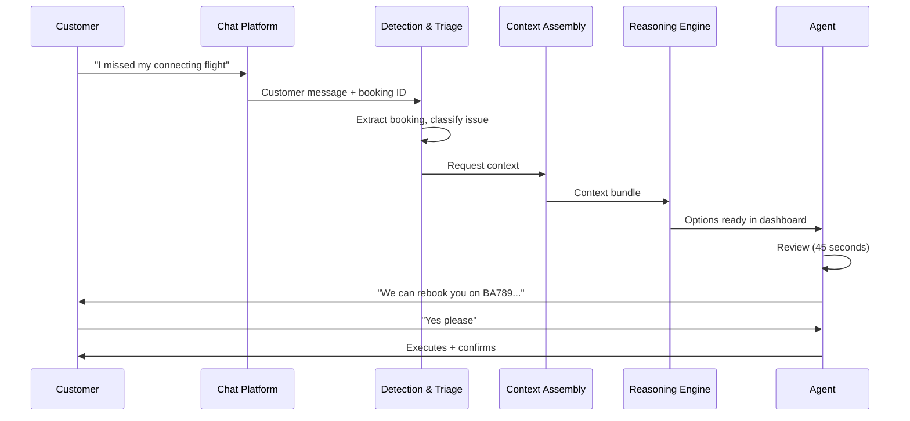

# System Design: Agent-Assisted CS Resolution System

*Agent-assisted customer support system for virtual interlining failure resolution at Pineapple Travel*

---

## Table of Contents
1. [Overview](#overview)
2. [System Architecture](#system-architecture)
3. [Component Details](#component-details)
4. [Data Flows](#data-flows)
5. [Integration Points](#integration-points)
6. [Error Handling](#error-handling)
7. [Scalability Considerations](#scalability-considerations)

---

## Overview

### Problem Statement
Pineapple Travel's virtual interlining creates complex failure scenarios (missed connections, schedule changes) where:
- No single airline owns the problem
- Responsibility is ambiguous
- Resolutions are inconsistent and slow
- Support agents lack context and decision support

### Solution
An LLM-powered agent-assistance system that:
- Detects failures proactively or via customer contact
- Gathers all relevant context automatically
- Generates valid resolution options with explanations
- Requires human approval for all MVP decisions
- Creates audit trail for learning and compliance

### Key Principles
1. **Human augmentation, not replacement**
2. **Urgency-based prioritisation** (not category-based)
3. **Explainability by default**
4. **Conservative start, gradual autonomy**
5. **Continuous learning from human decisions**

### System Flow Overview

This diagram shows the end-to-end flow from case trigger through customer resolution:



**Flow Steps:**
1. **Case Trigger** → Customer message or 3rd party API (flight status)
2. **Categorize** → LLM classifies issue type and urgency
3. **Context Assembly** → RAG retrieves:
   - Booking details from Booking Database (verify claim legitimacy)
   - Flight status cross-referenced with bookings (validate delays/cancellations)
   - Policies, laws, historical cases from vector DB
4. **LLM Reasoning** → Claude Sonnet receives prompt-injected rule book + context, generates resolution options with explanations
5. **Structured Output** → Formatted options with confidence scores, policy citations, reasoning, escalation flags
6. **Human Decision** → Agent reviews structured output and approves/modifies/rejects
7. **Execute** → Resolution delivered to customer
8. **Learning Loop** → Decisions logged to improve model

---

## System Architecture

### High-Level Architecture



### Technology Stack (Proposed)

| Component | Technology | Rationale |
|-----------|-----------|-----------|
| **Orchestration** | LangFlow / LangChain | Visual pipeline building, rapid prototyping |
| **Vector Store** | Qdrant or Weaviate | Open-source, scalable, good performance |
| **Embeddings** | bge-large-en-v1.5 | SOTA open-source, cost-effective |
| **Keyword Search** | Elasticsearch | Industry standard, proven at scale |
| **Fast LLM** | GPT-4o mini | Speed + cost for classification |
| **Reasoning LLM** | Claude 3.5 Sonnet | Best reasoning quality + explainability |
| **Rule Book** | Markdown + Git | Version controlled, auditable, fast iteration |
| **Backend** | Python/FastAPI | Fast development, great LLM ecosystem |
| **Frontend** | React + TypeScript | Agent dashboard needs interactivity |
| **Database** | PostgreSQL | Structured data, audit logs, booking records |
| **Queue** | Redis | Fast priority queue for cases |
| **Monitoring** | Datadog / New Relic | Observability for LLM systems |

---

## Component Details

### 1. Ingestion Layer

**Purpose**: Collect events from multiple sources and normalize into standard format

**Components**:
- **Event Collector**: Webhooks, polling, message queue subscriptions
- **Data Normalizer**: Convert diverse formats to internal schema

**Event Types**:
```json
{
  "event_type": "flight_delay|missed_connection|schedule_change|customer_contact",
  "timestamp": "2026-01-07T14:30:00Z",
  "booking_id": "KW123456",
  "flight_numbers": ["BA123", "EI456"],
  "urgency_hint": "high|medium|low",
  "source": "flight_api|customer|system",
  "raw_data": {}
}
```

**Integration Points**:
- FlightAware / FlightStats API (polling every 5 min for active bookings)
- Pineapple Travel booking system (webhooks on changes)
- Customer service platform (chat/email webhooks)

---

### 2. Detection & Triage

**Purpose**: Identify failures, assess urgency, categorise, and prioritise

#### Urgency Scorer (GPT-4o mini)

**Inputs**:
- Event data
- Current time vs departure time
- Customer location (if available)
- Booking value

**Output**:
```json
{
  "urgency": "critical|high|medium|low",
  "urgency_score": 0.95,
  "reasoning": "Customer in-airport with departure in 2 hours",
  "time_to_resolve_target": "5 minutes"
}
```

**Urgency Criteria**:
- **Critical**: In-airport, departure <3 hours, already missed connection
- **High**: In-transit, departure <24 hours
- **Medium**: Departure 1-7 days
- **Low**: Departure >7 days

**Latency**: <500ms (GPT-4o mini)

#### Category Classifier (GPT-4o mini)

**Categories**:
- Missed connection (self-transfer)
- Schedule change (airline-initiated)
- Cancellation (full/partial)
- Ticket error
- Multiple issues (compound)

**Latency**: <500ms

#### Priority Queue

Redis sorted set, scored by:
```python
priority_score = urgency_score * 1000 + (current_time - event_time)
```

Ensures:
- Most urgent cases processed first
- FIFO within same urgency level
- No starvation of lower-priority cases

---

### 3. Context Assembly (RAG)

**Purpose**: Gather all information needed for decision-making

#### Data Sources & Retrieval



#### Booking Database Verification (MVP-Critical)

**Purpose**: Verify claim legitimacy and enable proactive detection

**Key Functions**:
1. **Verify customer claims**: Confirm booking exists and customer has standing
2. **Cross-reference with Flight API**: Match booking flight numbers with real-time status
3. **Proactive monitoring**: Detect issues before customer contacts support
4. **Context enrichment**: Pull booking details (dates, routes, prices, class, guarantee status)
5. **Fraud prevention**: Ensure claims match actual bookings

**Data Retrieved**:
- Booking ID and status
- Flight numbers and segments
- Passenger details
- Guarantee purchase status
- Booking value and payment info
- Original booking timestamp

**Cross-Reference Logic**:
```python
# When Flight API detects delay/cancellation:
affected_bookings = booking_db.query(
    flight_number=delayed_flight,
    departure_date=affected_date,
    status="confirmed"
)
# Proactively create cases for affected bookings
```

**Latency**: <500ms (indexed queries)

#### Context Bundle Structure

```json
{
  "case_id": "CASE_20260107_001",
  "booking": {
    "booking_id": "KW123456",
    "flights": [...],
    "guarantee_purchased": true,
    "total_value": 450.00,
    "currency": "EUR"
  },
  "flights": [
    {
      "flight_number": "BA123",
      "status": "delayed",
      "scheduled": "2026-01-07T14:00:00Z",
      "estimated": "2026-01-07T16:30:00Z",
      "delay_reason": "weather"
    }
  ],
  "customer": {
    "customer_id": "CUST_789",
    "tier": "standard",
    "previous_issues": 1,
    "lifetime_value": 2300.00
  },
  "relevant_policies": [
    {
      "policy_id": "POL_001",
      "title": "Pineapple Guarantee - Missed Connections",
      "content": "...",
      "relevance_score": 0.94
    }
  ],
  "similar_cases": [
    {
      "case_id": "CASE_20251215_045",
      "similarity": 0.88,
      "resolution": "rebooking",
      "outcome": "resolved",
      "customer_satisfaction": 4.5
    }
  ]
}
```

#### Policy Knowledge Base

**Structure**:
- Pineapple Guarantee terms (chunked by section)
- Refund policies (by scenario)
- Airline partner rules
- Legal requirements (EU261, etc)
- Internal guidelines

**Indexing**:
- Vector embeddings (bge-large-en-v1.5)
- Keyword index (Elasticsearch)
- Metadata filters (policy_type, region, effective_date)

**Retrieval Strategy**:
1. Hybrid search (vector + BM25, weighted 70/30)
2. Retrieve top 10 candidates
3. Rerank with cross-encoder
4. Return top 5 with relevance scores

**Latency Budget**: <1 second

---

### 4. LLM Reasoning Engine

**Purpose**: Generate resolution options with explanations

#### Prompt-Injected Rule Book (MVP-Critical)

**Purpose**: Enforce policy compliance through prompt engineering rather than hard-coded validation

**Rule Book Structure**:
```markdown
# Pineapple Travel Customer Support Rule Book v1.0

## RULE-001: Guarantee Coverage - Missed Connections
IF customer purchased Pineapple Guarantee AND missed connection due to first flight delay
THEN Pineapple Travel must provide rebooking at no additional cost to customer
CITATION: Guarantee Terms Section 3.2

## RULE-002: Weather Delays - Airline Responsibility
IF delay caused by weather AND customer has not purchased Guarantee
THEN airline is responsible, NOT Pineapple Travel (refer to airline policy)
CITATION: Terms of Service Section 5.1

## RULE-003: Refund Limits Without Guarantee
IF customer did NOT purchase Guarantee AND requests refund
THEN maximum refund is 70% of unused segment value
CITATION: Refund Policy Section 2.3

[... additional rules ...]
```

**Injection Method**:
- Rules loaded from `rules/policy-rulebook.md` at runtime
- Version controlled in git (track changes)
- Prepended to system prompt before each LLM call
- Each rule has unique ID for citation tracking

**Benefits**:
- ✅ Iterate rules without code changes
- ✅ Auditable (rules visible in prompt logs)
- ✅ LLM can cite specific rules in reasoning
- ✅ Easy to A/B test rule formulations

#### Option Generator (Claude 3.5 Sonnet)

**Prompt Structure**:
```
You are an expert customer support agent for Pineapple Travel, specialising in 
resolving complex virtual interlining failures.

RULE BOOK (YOU MUST FOLLOW THESE RULES):
{prompt_injected_rulebook}

CURRENT SITUATION:
{context_bundle}

RELEVANT POLICIES:
{retrieved_policies}

SIMILAR PAST CASES:
{similar_cases}

TASK:
Generate 2-4 resolution options ranked by:
1. Customer satisfaction (prioritise their needs)
2. Policy compliance (MUST be valid per rules above)
3. Cost to Pineapple Travel (lower is better, but don't compromise #1)

For each option provide:
- Specific actions to take
- Expected cost to Pineapple Travel
- Expected customer satisfaction
- Policy justification (cite specific RULE-XXX)
- Pros and cons
- Confidence score (0-100)
- Uncertainty flags (if data missing or edge case)
- Escalation reasoning (if human judgment needed)

Format your response as JSON following this schema:
{schema}
```

**Structured Output Schema** (MVP-Critical):
```json
{
  "options": [
    {
      "option_id": 1,
      "title": "Rebook on next available flight (BA789)",
      "actions": [
        "Book customer on BA789 departing 18:00",
        "Provide lounge access voucher",
        "Send SMS with new itinerary"
      ],
      "cost_to_pineapple": {
        "amount": 125.00,
        "currency": "EUR",
        "breakdown": {
          "rebooking_fee": 100.00,
          "lounge_voucher": 25.00
        }
      },
      "customer_satisfaction_estimate": 4.0,
      "policy_justification": [
        {
          "rule_id": "RULE-001",
          "policy_id": "POL_001",
          "section": "3.2 Weather-Related Delays",
          "quote": "Pineapple Travel will rebook on next available flight..."
        }
      ],
      "pros": [
        "Gets customer to destination same day",
        "Covered by Guarantee (RULE-001)",
        "Similar to past successful resolutions"
      ],
      "cons": [
        "Cost to Pineapple Travel",
        "4-hour delay for customer"
      ],
      "confidence": 89,
      "reasoning": "High confidence because customer has Guarantee and similar cases resolved successfully. Flight BA789 availability confirmed.",
      "uncertainty_flags": [
        {
          "type": "data_gap",
          "description": "Customer dietary preferences unknown for lounge",
          "impact": "low"
        }
      ],
      "escalation_triggers": []
    },
    {
      "option_id": 2,
      "title": "Partial refund + self-booking assistance",
      "actions": [
        "Process 70% refund (€315)",
        "Provide flight search assistance",
        "Offer €50 voucher for future booking"
      ],
      "cost_to_pineapple": {
        "amount": 365.00,
        "currency": "EUR",
        "breakdown": {
          "refund": 315.00,
          "voucher": 50.00
        }
      },
      "customer_satisfaction_estimate": 3.2,
      "policy_justification": [
        {
          "rule_id": "RULE-003",
          "policy_id": "POL_002",
          "section": "5.1 Refund Terms",
          "quote": "Maximum 70% refund without Guarantee..."
        }
      ],
      "pros": [
        "Lower cost than full rebooking",
        "Customer has flexibility"
      ],
      "cons": [
        "Customer must handle rebooking",
        "Lower satisfaction expected"
      ],
      "confidence": 65,
      "reasoning": "Medium confidence. Customer has Guarantee so RULE-001 applies better, but this is valid fallback if rebooking unavailable.",
      "uncertainty_flags": [],
      "escalation_triggers": [
        {
          "reason": "customer_has_guarantee",
          "severity": "medium",
          "recommendation": "Option 1 preferred per RULE-001"
        }
      ]
    }
  ],
  "recommended_option_id": 1,
  "overall_confidence": 89,
  "escalation_recommended": false,
  "escalation_reasoning": "High confidence, clear rule application (RULE-001), sufficient data available",
  "reasoning_trace": "Customer purchased Guarantee. RULE-001 applies: must provide rebooking. Flight BA789 available and suitable. Cost reasonable. High confidence in Option 1."
}
```

**Structured Output Benefits** (MVP-Critical):

1. **Fast Agent Review**: 
   - Standardised format reduces cognitive load
   - Key metrics visible at a glance (confidence, cost, satisfaction)
   - Enables <90 second review time

2. **Confidence Transparency**:
   - 0-100 scale easy to interpret
   - Agents know when to scrutinize vs trust
   - Future autonomy: high confidence candidates

3. **Uncertainty Surfaced**:
   - Missing data explicitly flagged
   - Edge cases identified
   - Agents can request additional info

4. **Escalation Reasoning**:
   - Clear triggers for human judgment
   - Severity levels guide prioritisation
   - Explains why option may not be ideal

5. **Policy Citations**:
   - Rule IDs enable audit trail
   - Agents can verify compliance
   - Builds trust in system

6. **Metrics Tracking**:
   - Structured data enables analytics
   - Track confidence calibration
   - Measure approval rates by field

**Validation**:
- Policy Validator checks each option against hard rules
- Cost Validator ensures within authorization limits
- Feasibility Validator checks flight availability (API calls)
- Schema Validator ensures all required fields present

**Latency Budget**: <3 seconds

---

### 5. Human Interface

#### Agent Dashboard

**Key Features**:
1. **Case Queue**
   - Sorted by urgency
   - Color-coded by confidence (🟢🟡🔴)
   - Click to view full context

2. **Case Detail View**
   - Customer info + timeline
   - Full context displayed (booking, flights, policies)
   - LLM-generated options with confidence
   - Side-by-side comparison of options

3. **Decision Interface**
   - Approve option (click to execute)
   - Modify option (edit before executing)
   - Reject all (escalate to human brainstorming)
   - Request more info (trigger additional research)

4. **Communication Panel**
   - Template messages (auto-populated)
   - Send to customer (email/SMS/chat)
   - Real-time typing indicator

**Mockup Wireframe**:
```
┌─────────────────────────────────────────────────────────────┐
│ Case Queue                                    [Filters ▼]    │
├─────────────────────────────────────────────────────────────┤
│ 🔴 CASE_001 | Missed connection | In airport | 2 min ago   │
│ 🟡 CASE_002 | Schedule change  | Departs 4h  | 5 min ago   │
│ 🟢 CASE_003 | Ticket error     | Departs 2d  | 12 min ago  │
└─────────────────────────────────────────────────────────────┘

┌─────────────────────────────────────────────────────────────┐
│ CASE_001: Missed connection - BA123 → EI456                 │
├─────────────────────────────────────────────────────────────┤
│ Customer: Jane Doe (Tier: Standard, 1st issue)              │
│ Status: In Dublin airport, waiting for connecting flight    │
│ BA123 delayed 2.5h (weather) → missed EI456 to London       │
│                                                              │
│ 🤖 AI Suggestions (Confidence: 🟢 High - 89%)               │
│                                                              │
│ ✅ Option 1: Rebook on BA789 (18:00) + lounge              │
│    Cost: €125  |  Est. CSAT: 4.0/5  |  Same-day arrival   │
│    Policy: Covered by Guarantee (Section 3.2)               │
│    [View Details] [Approve] [Modify]                        │
│                                                              │
│ ⭕ Option 2: Refund €315 (70%) + rebooking advice          │
│    Cost: €315  |  Est. CSAT: 3.2/5  |  Customer self-books│
│    Policy: Standard refund per terms 5.1                    │
│    [View Details] [Approve] [Modify]                        │
│                                                              │
│ [Reject All - Escalate to Senior Agent]                     │
└─────────────────────────────────────────────────────────────┘
```

---

### 6. Execution Layer

**Purpose**: Execute approved resolutions

**Services**:
- **Rebooking Service**: Book new flights via airline APIs
- **Refund Processor**: Initiate refunds through payment system
- **Notification Service**: Send SMS/email/push to customer
- **Audit Logger**: Record all actions with timestamps

**Transaction Handling**:
- All operations logged before execution
- Idempotency keys prevent duplicate bookings
- Rollback capability if partial failure
- Customer notified at each step

---

### 7. Learning & Analytics

**Purpose**: Track outcomes, improve model, measure impact

#### Decision Logger

Logs every case:
```json
{
  "case_id": "CASE_20260107_001",
  "timestamp": "2026-01-07T15:22:00Z",
  "context": {...},
  "llm_suggestions": [...],
  "agent_decision": {
    "selected_option_id": 1,
    "modifications": null,
    "approval_time_seconds": 45
  },
  "execution_result": "success",
  "customer_satisfaction": 4.5,
  "resolution_cost": 125.00,
  "time_to_first_resolution_seconds": 180
}
```

#### Model Evaluator

**Weekly Analysis**:
- Agent approval rate by case type
- Confidence calibration (are high-confidence cases actually approved more?)
- Cost accuracy (estimated vs actual)
- CSAT prediction accuracy
- Identify systematic errors

**Output**: Recommendations for prompt tuning, policy updates, escalation criteria

---

## Data Flows

### Flow 1: Proactive Detection (Flight Delay)



**Latency**:
- Detection: <1 second
- Context assembly: <1 second
- LLM reasoning: <3 seconds
- **Total: <5 seconds** from event to agent notification

### Flow 2: Customer-Initiated Contact



**Latency**:
- Customer wait time: <5 seconds for first response template
- Agent decision time: 30-60 seconds (vs 5-10 min without system)
- **Total TTFR: <90 seconds** (vs 10-15 min baseline)

---

## Integration Points

### External APIs

| System | Purpose | Protocol | SLA |
|--------|---------|----------|-----|
| FlightAware | Real-time flight status | REST API | 99.9% uptime |
| Pineapple Travel Booking System | Booking data, modifications | Internal API | 99.95% uptime |
| Airline APIs | Rebooking, availability | REST/SOAP | Varies by airline |
| Payment Gateway | Refund processing | REST API | 99.9% uptime |
| Customer Service Platform | Chat, email, SMS | Webhooks + API | 99.5% uptime |

### Authentication & Security
- API keys rotated monthly
- All customer data encrypted at rest and in transit
- PCI DSS compliance for payment data
- GDPR compliance for EU customers
- Role-based access control (RBAC) for agents

---

## Error Handling

### LLM Failures

**Failure Modes**:
1. **Timeout** (>10s response)
   - Retry once
   - If fails again: Escalate to human without suggestions
   
2. **Invalid JSON** (parsing error)
   - Log error with full context
   - Retry with simplified prompt
   - If fails: Escalate to human

3. **Policy Violation** (validator rejects)
   - Log violation details
   - Request alternative from LLM
   - If persistent: Escalate to human

4. **Hallucination** (suggests impossible option)
   - Feasibility validator catches
   - Log for model improvement
   - Filter out invalid option
   - If no valid options: Escalate

**Fallback Strategy**:
- Always degrade gracefully to human-only mode
- Agent sees all context even if LLM fails
- System never blocks human from working

### Integration Failures

**Booking System Down**:
- Queue cases until system recovers
- Prioritise by urgency when back online
- Manual workaround: Agent can enter data manually

**Flight API Down**:
- Use cached flight data (if recent)
- Display "Data may be stale" warning
- Agent can manually verify

---

## Scalability Considerations

### Current MVP Scale
- 100 cases/day
- 5 concurrent agents
- <$100/day in LLM costs

### Growth Path
| Metric | Phase 1 | Phase 2 | Phase 3 |
|--------|---------|---------|---------|
| Cases/day | 100 | 1,000 | 10,000 |
| Agents | 5 | 50 | 200 |
| Response time | <5s | <3s | <2s |
| LLM cost/case | $0.05 | $0.03 | $0.01 |

### Bottlenecks & Mitigations

**LLM API rate limits**:
- Cache repeated queries
- Batch non-urgent cases
- Self-hosted open-source models for classification

**Vector search at scale**:
- Shard by region/time
- Approximate nearest neighbor (ANN)
- Separate hot/cold data

**Database writes (decision logs)**:
- Async logging (don't block agent)
- Batch writes
- Time-series database for analytics

---

## Monitoring & Observability

### Key Metrics

**System Health**:
- Latency (p50, p95, p99) for each component
- Error rates (LLM failures, API timeouts)
- Queue depth and wait time

**Business Metrics**:
- Time to First Resolution (TTFR)
- Agent approval rate
- Customer CSAT (per resolution type)
- Cost per resolution
- Repeat contact rate

**ML Metrics**:
- Confidence calibration
- Hallucination rate
- Policy compliance rate
- Similar case retrieval accuracy

### Alerts

**Critical** (page on-call):
- System down >5 minutes
- Error rate >10%
- High-urgency cases waiting >10 minutes

**Warning** (email team):
- Agent approval rate drops below 70%
- LLM latency p95 >5 seconds
- Cost per case exceeds budget by 20%

---

## Security & Compliance

### Data Privacy
- Customer PII encrypted at rest (AES-256)
- PII redacted from LLM prompts where possible
- Audit log of all PII access
- Right to deletion supported (GDPR)

### Compliance
- **EU261**: System enforces passenger rights
- **PCI DSS**: Payment data handling compliant
- **GDPR**: Data minimization, consent tracking
- **Internal**: All decisions auditable

### Access Control
- Agents: Read access to assigned cases only
- Senior agents: Can override system recommendations
- Managers: Full audit log access
- Engineers: Anonymized data only for model improvement

---

## Future Enhancements

### Phase 2: Selective Autonomy
- Auto-execute high-confidence (>0.95) rebookings after customer approval
- Proactive customer communication ("We've found an alternative...")
- Predictive rebooking (before customer notices issue)

### Phase 3: Advanced Features
- Multi-language support (translate policies, generate responses)
- Sentiment analysis for escalation (detect frustrated customers)
- Personalization (learn customer preferences)
- Predictive analytics (identify failure-prone itineraries at booking time)

### Phase 4: Ecosystem Integration
- Share resolution patterns with airline partners
- Industry-wide knowledge base (anonymized)
- API for third-party travel insurance providers

