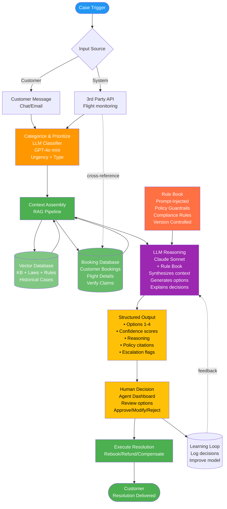

# System Overview: Agent-Assisted CS Resolution System

*Agent-assisted customer support system for virtual interlining failure resolution at Pineapple Travel*

---

## Table of Contents
1. [Overview](#overview)
2. [System Architecture](#system-architecture)
3. [Component Details](#component-details)
4. [User Journeys](#user-journeys)
5. [Integration Requirements](#integration-requirements)
6. [Handling Failures](#handling-failures)
7. [Scaling Considerations](#scaling-considerations)
8. [Measuring Success](#measuring-success)
9. [Security & Compliance](#security--compliance)
10. [Future Enhancements](#future-enhancements)

---

## Overview

### Problem Statement
Pineapple Travel's virtual interlining creates complex failure scenarios (missed connections, schedule changes) where:
- No single airline owns the problem
- Responsibility is ambiguous
- Resolutions are inconsistent and slow
- Support agents lack context and decision support

**Research Insight**: Customer reviews reveal that dissatisfaction spikes during disruptions, not smooth trips. Key themes:
- "Customers say the guarantee covers nothing" → transparency gap
- "Left stranded in airports" → need for proactive, urgent response
- "Support agents hide behind policy" → need for clear reasoning and empowerment
- "Months waiting for refunds" → need for fast, consistent resolutions

This system directly addresses these pain points through transparent reasoning, proactive detection, and agent empowerment

### Solution
An LLM-powered agent-assistance system that:
- Detects failures proactively or via customer contact
- Gathers all relevant context automatically
- Generates valid resolution options with explanations
- Requires human approval for all MVP decisions
- Creates audit trail for learning and compliance

### Key Principles
1. **Human augmentation, not replacement**
2. **Urgency-based prioritisation** (not category-based)
3. **Explainability by default**
4. **Conservative start, gradual autonomy**
5. **Continuous learning from human decisions**
6. **Built to scale and reuse** (platform architecture)

### System Flow Overview

This diagram shows the end-to-end flow from case trigger through customer resolution:

**Flow Steps:**
1. **Case Trigger** → Customer message or 3rd party API (flight status)
2. **Categorize** → LLM classifies issue type and urgency
3. **Context Assembly** → RAG retrieves:
   - Booking details from Booking Database (verify claim legitimacy)
   - Flight status cross-referenced with bookings (validate delays/cancellations)
   - Policies, laws, historical cases from vector DB
4. **LLM Reasoning** → Claude Sonnet receives prompt-injected rule book + context, generates resolution options with explanations
5. **Structured Output** → Formatted options with confidence scores, policy citations, reasoning, escalation flags
6. **Human Decision** → Agent reviews structured output and approves/modifies/rejects
7. **Execute** → Resolution delivered to customer
8. **Learning Loop** → Decisions logged to improve model

---

## System Architecture

### Key Dependencies

The system requires integration with several external systems and internal capabilities:

**External Dependencies:**
- **Flight status data** - Real-time monitoring of delays, cancellations, schedule changes
- **Booking system** - Customer booking details, verification, modifications
- **Customer communication channels** - Chat, email, SMS for inbound and outbound messaging
- **Airline APIs** - For rebooking, availability checks, and execution

**Internal Capabilities:**
- **Knowledge base** - Policies, laws, regulations, historical resolutions
- **LLM services** - Fast classifier (GPT-4o mini) and reasoning engine (Claude Sonnet)
- **Agent dashboard** - Interface for reviewing and approving LLM suggestions
- **Analytics platform** - Tracking decisions, outcomes, and continuous improvement

### Prototype Technology Stack

*Note: This section describes the minimal technology stack for building a working prototype/demo. In production, all technology decisions would be made by the engineering team based on scale, performance, and infrastructure requirements.*

| Component | Technology | Rationale |
|-----------|-----------|-----------|
| **Orchestration** | LangFlow | Visual pipeline building, rapid prototyping (demo only) |
| **Vector Store** | ChromaDB | Simple, local-first, easy setup for prototype |
| **Embeddings** | OpenAI text-embedding-3-small | API-based, no infrastructure needed |
| **Fast LLM** | GPT-4o mini | Speed + cost for classification |
| **Reasoning LLM** | Claude 3.5 Sonnet | Best reasoning quality + explainability |
| **Rule Book** | Markdown + Git | Version controlled, auditable, fast iteration |

*For prototype: No backend/frontend framework, database, queue, or monitoring infrastructure needed. Simple Python scripts and LangFlow UI sufficient to demonstrate core concepts.*

---

## Component Details

*Note: This section outlines the conceptual components and their purpose. Technical implementation details would be determined by the engineering team.*

### 1. Event Detection & Intake

**What it does**: Captures disruption signals from multiple sources and determines what needs attention

**Key Sources**:
- Flight status APIs (proactive detection before customer knows)
- Customer-initiated contact (reactive - they're already aware)
- Booking system changes (schedule updates, cancellations)

**Critical Decision**: How do we prioritise?
- **Urgency-based**, not first-come-first-served
- Factors: Time to departure, customer location, booking value, guarantee status
- Critical (in-airport) cases surface immediately; future issues can wait

**Why this matters**: Customers in airports need responses in minutes, not hours. The system must understand context to prioritise appropriately.

---

### 2. Context Assembly & Verification

**What it does**: Gathers everything an agent needs to make an informed decision, automatically

**What gets pulled together**:
- **Booking verification**: Does this booking exist? Does the customer have standing?
- **Flight status**: Real-time data on delays, cancellations, alternatives
- **Policy lookup**: Which rules apply? Guarantee coverage, refund eligibility, EU261 rights
- **Historical cases**: How have we resolved similar situations before?
- **Customer context**: Tier, previous issues, lifetime value

**Critical Decision**: Cross-reference flight status with bookings
- Enables proactive detection: "Flight BA123 delayed → which of our customers are affected?"
- Prevents fraud: Verify claims match actual bookings
- Provides complete picture: Don't just trust what customer says, validate

**Why this matters**: Agents typically hunt for information across multiple systems (bookings, flight status, policies, history). Automating context assembly could significantly reduce TTFR and ensure nothing is missed.

---

### 3. Intelligent Resolution Generation

**What it does**: Uses LLM to generate 2-4 valid resolution options with clear reasoning

**How it works** (conceptually):
1. **Rule book**: Policies injected into LLM prompt (version controlled, easy to update)
2. **Context synthesis**: LLM reviews all assembled information
3. **Option generation**: Creates multiple valid solutions ranked by customer satisfaction, policy compliance, cost
4. **Explainability**: Cites which rules apply, why each option is valid

**Structured Output Includes**:
- Resolution options (what to do)
- Confidence scores (how certain is the LLM?)
- Policy citations (which rules were applied)
- Reasoning (why this option makes sense)
- Uncertainty flags (missing data or edge cases)
- Escalation triggers (when human judgment is needed)

**Critical Decision**: Prompt-injected rules vs hard-coded logic
- **Choice**: Prompt injection (rules as text in the prompt)
- **Why**: Faster iteration, easy to audit, no code changes for policy updates
- **Trade-off**: Slightly less enforcement guarantee than hard-coded, but massively more flexible

**Why this matters**: Agents need to review options quickly and confidently. Clear structure + reasoning = fast decisions. Confidence scores signal when to trust vs scrutinise.

---

### 4. Human Review & Decision

**What it does**: Presents options to agent for review, approval, or modification

**Agent sees**:
- All context that was assembled (booking, flight status, policies, history)
- LLM-generated resolution options with explanations
- Confidence indicators (🟢 high, 🟡 medium, 🔴 low)
- Ability to approve, modify, or reject any option

**Critical Decision**: 100% human-in-the-loop for MVP
- **Why**: Build trust, collect training data, prove value before considering automation
- **Future**: High-confidence cases could be auto-executed after validation period

**Why this matters**: Agents are the customer champions. The system augments their judgment, doesn't replace it. They always have final say.

---

### 5. Execution & Learning

**What it does**: Executes approved resolutions and logs everything for continuous improvement

**Execution**: 
- Rebooking through airline APIs
- Refund processing
- Customer notifications (SMS, email)
- Track completion and customer response

**Learning Loop**:
- Log every decision: what LLM suggested, what agent chose, what outcome resulted
- Track metrics: approval rates, confidence calibration, cost accuracy, customer satisfaction
- Generate insights: Improve prompts, identify patterns, refine rules
- Close the loop: Better suggestions over time

**Why this matters**: Every interaction is training data. The system gets smarter by learning from agent decisions and customer outcomes.

---

## Key Design Principles

1. **Graceful degradation**: If any component fails, agent can still work (system doesn't block humans)
2. **Transparency**: Agent sees everything the system sees
3. **Auditability**: Every decision logged with full context
4. **Composability**: Components can be reused for other use cases (customer-facing apps, different channels)

---
## User Journeys

### Journey 1: Proactive Resolution (System Detects Issue First)

**Scenario**: Flight delay detected before customer contacts us

1. **System detects** disruption via flight status monitoring
2. **System identifies** affected Pineapple Travel bookings automatically
3. **System calculates** urgency (e.g., customer in-airport vs. tomorrow's flight)
4. **System assembles** all relevant context (booking, alternatives, policies)
5. **LLM generates** resolution options with reasoning
6. **Agent receives** high-priority notification with pre-assembled options
7. **Agent reviews** and approves best option (seconds, not minutes)
8. **Customer contacted** proactively with solution before they even know there's a problem

**Why this matters**: Research shows customers are "left stranded in airports" when issues arise. Proactive detection with pre-assembled options means agents can respond in minutes, not hours—critical for in-airport emergencies. Transforms the experience from reactive firefighting to proactive assistance.

---

### Journey 2: Reactive Resolution (Customer Contacts Us)

**Scenario**: Customer reaches out about a missed connection

1. **Customer contacts** support via chat/email ("I missed my flight")
2. **System categorises** issue type and urgency automatically
3. **System assembles** context while agent greets customer
4. **Agent sees** pre-loaded context + LLM-generated options (no hunting across systems)
5. **Agent reviews** options quickly, approves or modifies
6. **Agent responds** to customer with confidence and speed
7. **Resolution executed** (rebooking, refund, etc.)
8. **Customer satisfied** with fast, informed response

**Why this matters**: Research reveals agents are perceived as "powerless" and "hiding behind policy." Pre-assembled context + LLM reasoning with policy citations empowers agents to give confident, explained answers instead of scripted responses. Transforms agents from gatekeepers to problem-solvers.

---

## Integration Requirements

### Critical Integrations

**Flight Status Monitoring**
- **What we need**: Real-time data on delays, cancellations, gate changes
- **Why it matters**: Enables proactive detection before customers contact us
- **Dependency**: Third-party flight data providers (FlightAware, similar)
- **Risk**: If this fails, system becomes reactive-only (still functional, but less proactive)

**Booking System**
- **What we need**: Customer booking details, verification, ability to modify bookings
- **Why it matters**: Core to verifying customer claims and executing resolutions
- **Dependency**: Pineapple Travel's internal booking platform
- **Risk**: Critical dependency - if unavailable, agents must work manually

**Airline APIs**
- **What we need**: Availability checks, rebooking capabilities, seat selection
- **Why it matters**: Execute approved resolutions automatically
- **Dependency**: Varies by airline partner (some have APIs, others require manual work)
- **Risk**: Inconsistent - may need manual fallback for some airlines

**Customer Communication Channels**
- **What we need**: Inbound messages (chat, email) and outbound notifications (SMS, email)
- **Why it matters**: How customers reach us and how we deliver resolutions
- **Dependency**: Existing customer service platform
- **Risk**: If down, can't communicate with customers (critical)

### Security & Compliance Considerations
- Customer data must be encrypted and access-controlled
- Payment information requires PCI DSS compliance
- EU customers protected under GDPR (right to deletion, data minimisation)
- All decisions must be auditable for compliance and learning

---

## Handling Failures

### Core Principle: Never Block the Human

The system is designed to **augment agents, not replace them**. If any component fails, agents must still be able to do their job manually.

### LLM Unavailability

**What happens:**
- Agent still sees all assembled context (booking, flight status, policies, history)
- Agent works without LLM suggestions (how they work today)
- System logs the failure for engineering to investigate

**Why this approach:**
- LLMs are powerful but not 100% reliable
- Agents are the ultimate decision-makers
- Service continues even if AI component fails

**Product decision**: Prioritise availability over perfection

---

### Integration Failures

**Flight Status API Unavailable:**
- System uses most recent cached data (if available)
- Dashboard shows clear warning: "Flight data may be stale"
- Agent can manually verify with airline if needed
- Proactive detection is temporarily disabled, but reactive support continues

**Booking System Unavailable:**
- High impact - core system dependency
- Cases queue automatically by urgency
- When system recovers, highest-priority cases processed first
- Manual workaround: Agent can look up booking details separately

**Airline APIs Unavailable:**
- LLM can still generate resolution options
- Agent executes resolution manually (phone call to airline, etc.)
- More time-consuming but doesn't block resolution

---

### LLM Quality Issues

**Hallucinations or Policy Violations:**
- For MVP: Human-in-the-loop catches these
- Agent sees reasoning and can reject if nonsensical
- System logs instances for prompt improvement
- Over time: Build validation rules to catch common errors

**Low Confidence Suggestions:**
- System surfaces confidence scores to agent
- Low confidence = agent scrutinises more carefully
- Option to escalate to senior agent or supervisor
- Helps calibrate trust over time

**Why this matters**: Building trust with agents is critical. They need to feel confident that the system helps, not hinders.

---

## Scaling Considerations

### MVP Assumptions
- **Volume**: ~100 disruption cases per day
- **Team size**: 5-10 agents handling virtual interlining issues
- **Cost target**: <£0.10 per case in LLM costs

### Growth Path

As the system proves value, we expect usage to scale:

| Phase | Daily Cases | Agent Team | Key Challenge |
|-------|-------------|------------|---------------|
| **Phase 1 (MVP)** | 100 | 5-10 | Prove value, build trust |
| **Phase 2** | 1,000 | 50+ | Maintain quality at scale |
| **Phase 3** | 10,000+ | 200+ | Cost optimisation, automation |

### Key Constraints

**LLM Costs**
- Claude Sonnet is premium-priced but provides best reasoning quality
- As volume grows, cost per case must decrease
- Options: Caching repeated queries, faster models for simple cases, batch processing

**Response Speed**
- MVP target: Agent sees options within seconds
- As volume grows, need to maintain fast response
- Options: Parallel processing, pre-computation for predictable scenarios

**Knowledge Base Maintenance**
- Policies, regulations, and historical cases grow over time
- Must keep retrieval fast and relevant
- Options: Better indexing, relevance tuning, archiving old cases

**Integration Dependencies**
- More cases = more API calls to airlines, flight status providers
- Rate limits and costs may become constraints
- Options: Strategic caching, direct partnerships, redundancy

### Why This Matters

Scalability isn't just about technical performance - it's about **maintaining quality as we grow**. The system must remain helpful to agents even at 10x volume.

---

## Measuring Success

### Success Metrics for MVP

**Agent Satisfaction (Primary)**
- Do agents find the system helpful? (Survey: >4/5)
- Are they approving LLM suggestions? (Target: >80%)
- Are they saving time? (Qualitative feedback + observation)

**Customer Outcomes**
- Time to First Resolution (TTFR) - how much faster compared to baseline?
- Customer satisfaction (CSAT) for disrupted trips - does it improve?
- Repeat contact rate - are we solving problems fully the first time?

**System Performance**
- Hallucination rate - is the LLM generating valid options? (Target: <2%)
- Confidence calibration - when LLM is confident, is it usually right?
- Cost per case - staying within budget? (Target: <£0.10)

**Learning Indicators**
- Are we collecting good training data from agent decisions?
- Can we identify patterns in approvals vs rejections?
- Is the system improving over time as it learns?

---

### What to Monitor Continuously

**Agent Experience:**
- How often do agents approve vs modify vs reject options?
- Which types of cases work well vs struggle?
- Are agents waiting too long for suggestions?

**LLM Behaviour:**
- Is it citing policies correctly?
- Are confidence scores meaningful to agents?
- Are there systematic errors or gaps in knowledge?

**Business Impact:**
- Cost per resolution (LLM + execution)
- Overall CSAT trend for disrupted customers
- Agent productivity (cases per hour)

**Integration Health:**
- Are flight status updates timely?
- Are bookings being retrieved successfully?
- Are resolution executions (rebookings, refunds) working?

---

### Red Flags to Watch For

- **Agent approval rate drops suddenly** → System may have regressed, needs investigation
- **High-urgency cases delayed** → Prioritisation not working, immediate fix needed
- **CSAT declining** → Resolutions may not be meeting customer needs
- **Costs increasing unexpectedly** → LLM usage may need optimisation

**Why this matters**: MVP is about learning and iteration. Good metrics tell us what's working and what needs improvement.

---

## Security & Compliance

### Data Privacy Principles

**Customer data protection:**
- All customer information must be encrypted and access-controlled
- Sensitive data (PII) minimised in LLM prompts where possible
- Full audit trail of who accessed what customer data and when
- Customers' right to deletion must be supported (GDPR requirement)

**Why this matters**: We're handling sensitive booking, payment, and personal information. Any data breach would be catastrophic for trust.

---

### Regulatory Compliance

**EU261 (Passenger Rights):**
- System must recommend resolutions that comply with EU passenger rights regulations
- Prompt-injected rule book includes EU261 requirements
- Agents can cite specific regulations when explaining decisions to customers

**Payment Handling (PCI DSS):**
- Refund processing must comply with payment card industry standards
- Payment information never stored in LLM context or logs

**Data Protection (GDPR):**
- Collect only necessary customer data (data minimisation)
- Track consent for data usage
- Support customer requests to delete their data
- All decisions must be explainable to customers if requested

**Internal Auditability:**
- Every decision logged with full reasoning
- Managers can review agent actions and LLM suggestions
- Critical for quality control and continuous improvement

---

### Access Control

**Principle of least privilege:**
- Agents see only cases assigned to them
- Senior agents can override system recommendations when needed
- Managers have audit access to review performance and quality
- Engineers work with anonymised data for model improvement (no customer PII)

**Why this matters**: Limits potential damage from any security breach or misuse.

---

## Future Enhancements

### Phase 2: Selective Autonomy
- Auto-execute high-confidence (>0.95) rebookings after customer approval
- Proactive customer communication ("We've found an alternative...")
- Predictive rebooking (before customer notices issue)

### Phase 3: Advanced Features
- Multi-language support (translate policies, generate responses)
- Sentiment analysis for escalation (detect frustrated customers)
- Personalization (learn customer preferences)
- Predictive analytics (identify failure-prone itineraries at booking time)

### Phase 4: Ecosystem Integration
- Share resolution patterns with airline partners
- Industry-wide knowledge base (anonymized)
- API for third-party travel insurance providers

