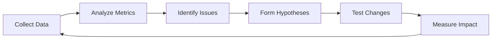

# Evaluation Framework

*How to measure success of the agent-assisted CS resolution system*

---

## Table of Contents
1. [Evaluation Philosophy](#evaluation-philosophy)
2. [Offline Evaluation (Pre-Production)](#offline-evaluation-pre-production)
3. [Online Evaluation (Production)](#online-evaluation-production)
4. [Business Metrics](#business-metrics)
5. [ML Quality Metrics](#ml-quality-metrics)
6. [Continuous Improvement](#continuous-improvement)

---

## Evaluation Philosophy

### Core Principles

1. **Multi-stakeholder success**: Must work for customers, agents, and business
2. **Safety first**: Catch failures before they reach customers
3. **Continuous measurement**: Not one-time validation
4. **Comparative**: Always measure against baseline (human-only)
5. **Actionable**: Metrics must inform concrete improvements

### Success Hierarchy

```
Level 1: System works (no crashes, acceptable latency)
    ↓
Level 2: LLM outputs are valid (no hallucinations, policy-compliant)
    ↓
Level 3: Agents find it useful (high approval rate, time savings)
    ↓
Level 4: Customers are satisfied (CSAT, resolution quality)
    ↓
Level 5: Business impact (cost reduction, efficiency gains)
```

**Gate criteria**: Must pass each level before promoting to next phase.

---

## Offline Evaluation (Pre-Production)

**Goal**: Validate LLM quality before exposing to real agents/customers

### Test Set Creation

#### Historical Cases (Gold Standard)
- **Size**: 100-200 cases with known outcomes
- **Selection criteria**:
  - Diverse failure types (missed connection, cancellation, schedule change)
  - Range of urgency levels
  - Mix of simple and complex scenarios
  - Represent customer tier distribution
  - Include edge cases and past failures

#### Labeling Process
For each test case, record:
```json
{
  "case_id": "TEST_001",
  "context": {...},
  "human_decision": {
    "option_selected": "rebook on BA789",
    "cost": 125.00,
    "customer_satisfaction": 4.5,
    "time_to_resolve_minutes": 8,
    "agent_notes": "Customer happy with lounge voucher"
  },
  "ground_truth_label": "optimal_resolution"
}
```

### Evaluation Metrics (Offline)

#### 1. Accuracy: Does LLM Match Human Decision?

**Metric**: Exact match rate
```
Accuracy = (Cases where LLM top option matches human choice) / Total cases
```

**Target**: >70% for MVP (humans are creative, perfect match unrealistic)

**Analysis**:
- Break down by case type (where does it excel/struggle?)
- When LLM differs, is its option also valid? (secondary validation)

#### 2. Coverage: Does LLM Provide Valid Options?

**Metric**: Valid option rate
```
Coverage = (Cases with at least one valid option) / Total cases
```

**Target**: >95% (acceptable to fail on extreme edge cases)

**Validation**:
- Policy compliance check (automated)
- Feasibility check (flights actually available?)
- Cost reasonableness (<3x human average)

#### 3. Hallucination Rate: Invalid Suggestions

**Metric**: Hallucination rate
```
Hallucination Rate = (Options with factual errors) / Total options generated
```

**Target**: <2%

**Error types**:
- Non-existent flights
- Incorrect policy citations
- Impossible timelines (flight already departed)
- Math errors (cost calculations)

**Detection**:
- Automated validators
- Manual review of random sample (10%)

#### 4. Explanation Quality

**Metric**: Human evaluator rating (1-5 scale)

**Criteria**:
- Is reasoning clear and logical?
- Are policy citations accurate?
- Is confidence calibration appropriate?
- Could an agent explain this to a customer?

**Target**: >4.0 average rating

**Process**:
- 3 evaluators rate 50 random explanations
- Inter-rater reliability >0.8 (Cohen's kappa)

#### 5. Confidence Calibration

**Metric**: Calibration plot + Expected Calibration Error (ECE)

```
For each confidence bucket (0-0.2, 0.2-0.4, ... 0.8-1.0):
    Accuracy in that bucket should match confidence
```

**Example**:
- Cases where LLM says 90% confident → should be correct ~90% of time
- If actually correct only 60% → overconfident (bad!)

**Target**: ECE <0.1

**Visualization**:
```
Accuracy
1.0 |                    ●
    |                ●
    |            ●
    |        ●
    |    ●
0.0 |____________________
    0.2  0.4  0.6  0.8  1.0
         Confidence
```
(Points should be near diagonal line)

### Offline Testing Process

**Weekly Regression Testing**:
1. Run test set through current system
2. Compare metrics to previous week
3. Flag regressions (>5% drop in any metric)
4. Investigate: prompt changes? model updates? data drift?

**A/B Testing Prompts**:
- Test new prompt variants on test set
- Promote winner to production
- Document what improved and why

---

## Online Evaluation (Production)

**Goal**: Measure real-world performance with real agents and customers

### Phase 1: Shadow Mode (Weeks 1-2)

**Setup**: System runs in background, agents don't see suggestions

**Measurement**:
- Compare LLM suggestions to actual agent decisions (post-hoc)
- Identify agreement rate and patterns
- Tune system based on gaps

**Gate**: Agreement rate >60% before showing to agents

### Phase 2: Parallel Run (Weeks 3-4)

**Setup**: Agents see LLM suggestions but not required to use

**Measurement**:
- Track which agents try it
- Agent feedback surveys (what's useful? what's not?)
- Approval rate by agent (identify training needs)

**Gate**: >3 agents voluntarily adopt before mandatory rollout

### Phase 3: Full Deployment (Week 5+)

**Setup**: All agents use system (but still approve/reject each suggestion)

**Measurement**: See Online Metrics below

### Online Metrics (Production)

#### 1. Agent Approval Rate

**Definition**: % of LLM suggestions accepted by agents without modification

**Calculation**:
```
Approval Rate = (Approved) / (Approved + Modified + Rejected)
```

**Targets**:
- Week 1: >60% (learning phase)
- Month 1: >75%
- Steady state: >85%

**Segmentation**:
- By case type (where are we weak?)
- By agent (training issue vs system issue?)
- By confidence level (are high-confidence cases approved more?)

**Alerts**:
- Drop below 70% for 2 consecutive days → investigate

#### 2. Time to First Resolution (TTFR)

**Definition**: Time from case assignment to agent sending first resolution to customer

**Baseline**: 10-15 minutes (human-only, from historical data)

**Target**:
- MVP: <5 minutes (50% reduction)
- Phase 2: <3 minutes

**Measurement**:
```
TTFR = timestamp(agent_sends_message) - timestamp(case_assigned)
```

**Segmentation**:
- By case complexity (simple vs compound issues)
- By agent experience (junior vs senior)
- With vs without LLM approval (A/B test if possible)

#### 3. Customer Satisfaction (CSAT)

**Definition**: Post-resolution survey score (1-5)

**Survey** (sent 24h after resolution):
```
How satisfied were you with the resolution of your recent issue?
1 ☆ Very dissatisfied
2 ☆☆ Dissatisfied  
3 ☆☆☆ Neutral
4 ☆☆☆☆ Satisfied
5 ☆☆☆☆☆ Very satisfied
```

**Baseline**: 3.2 (from research on disrupted trips)

**Target**: 
- MVP: >3.5 (+10%)
- Phase 2: >4.0 (+25%)

**Segmentation**:
- By resolution type (rebook vs refund)
- By urgency (critical cases harder to satisfy)
- LLM-approved vs agent-modified

**Statistical significance**: 
- Need >50 responses per segment for meaningful comparison
- Use t-test to confirm difference from baseline

#### 4. Resolution Cost

**Definition**: Average cost to Kiwi per resolution

**Components**:
- Rebooking fees
- Refunds issued
- Vouchers/compensation
- LLM API costs

**Baseline**: €180 per case (from finance estimate)

**Target**:
- MVP: <€200 (allow for LLM cost, optimize later)
- Phase 2: <€150 (better option selection)

**Watch for**:
- LLM suggesting too-generous options (popularity vs cost balance)
- Cost creep over time (are we learning bad patterns?)

#### 5. Repeat Contact Rate

**Definition**: % of cases where customer contacts again within 7 days

**Baseline**: 18% (from support metrics)

**Target**: <12% (indicates better first-time resolution)

**Reasons for repeat**:
- Resolution didn't work (flight still unavailable)
- Customer didn't understand resolution
- New issue emerged (cascading failure)

**Investigation**: 
- Manual review of 100% of repeat contacts
- Categorize reasons
- Feed back into prompt improvements

#### 6. Agent Cognitive Load (Qualitative)

**Measurement**: Weekly agent survey

**Questions** (1-5 scale):
1. "The system saves me time" (time savings)
2. "The system helps me make better decisions" (decision quality)
3. "I trust the system's suggestions" (trust)
4. "The system is easy to use" (usability)
5. "I feel less stressed handling complex cases" (cognitive load)

**Target**: >4.0 average on all questions

**Frequency**: Weekly for first month, then monthly

**Action**: 
- Scores <3.5 trigger 1-on-1 interviews with low-scoring agents
- Identify UX issues, training gaps, or system limitations

---

## Business Metrics

### North Star: TTFR Reduction → Cost Savings

**Model**:
```
Annual Savings = (Cases/year) × (TTFR reduction in hours) × (Agent hourly cost)
                 - (LLM costs)
                 - (System development & maintenance)

Example:
= 36,500 cases × (10 min saved) × (€30/hour)
= 36,500 × (1/6 hour) × €30
= €182,500 in agent time saved

- €18,250 LLM costs (@$0.05/case)
- €50,000 development & maintenance
= €114,250 net annual savings
```

**Break-even**: If TTFR reduces by >5 minutes on average

### Secondary Business Metrics

#### Customer Lifetime Value (LTV) Impact

**Hypothesis**: Better resolution → higher retention → higher LTV

**Measurement**:
- Cohort analysis: Customers with disrupted trips (Q1 2026)
- Track: Do they book again within 6 months?
- Compare: System-resolved vs human-only resolved (if A/B test)

**Expected impact**: +5-10% retention (speculative, needs validation)

#### Support Ticket Deflection

**Hypothesis**: Proactive resolution → fewer inbound contacts

**Measurement** (Phase 3, when proactive):
- # of cases resolved before customer contact
- Estimated tickets prevented

**Expected impact**: -10% inbound volume

#### Agent Retention & Satisfaction

**Hypothesis**: Better tools → happier agents → lower turnover

**Measurement**:
- Agent turnover rate (compare to historical)
- Exit interview mentions of tools (qualitative)

**Expected impact**: Hard to isolate, but worth tracking

---

## ML Quality Metrics (Production)

### 1. Prediction Accuracy (Live Cases)

**Challenge**: Don't have ground truth (agent decision is not always "right")

**Proxy Metrics**:
- **Agreement rate**: How often does agent pick LLM's #1 option?
- **Top-3 accuracy**: Is agent's choice in LLM's top 3 options?
- **Customer outcome**: Does CSAT match LLM's prediction?

**Target**: Top-3 accuracy >90%

### 2. Confidence Calibration (Live)

**Measurement**: 
- For each confidence bucket, track agent approval rate
- High confidence (>0.85) cases should be approved >95%
- Medium confidence (0.6-0.85) cases approved ~75%
- Low confidence (<0.6) cases approved ~40-50%

**Recalibration**:
- If miscalibrated, adjust confidence thresholds
- Can use Platt scaling or isotonic regression

### 3. Edge Case Detection

**Definition**: Cases where system struggled (low confidence, agent rejected, customer complained)

**Process**:
1. Automatically flag: confidence <0.4 OR agent rejected OR CSAT <3
2. Manual review (PM + senior agent)
3. Categorize: 
   - LLM limitation (needs better prompt/model)
   - Data quality (missing flight info)
   - Truly unsolvable (no good options)
4. Create new test cases from real failures
5. Measure: Are we seeing same edge cases repeatedly? (should decrease)

**Target**: <5% of cases flagged as edge cases (steady state)

### 4. Retrieval Quality (RAG)

**Metric**: Retrieval precision & recall

**Measurement** (manual, on sample):
- 50 random cases per week
- Human expert reviews: 
  - "Were the right policies retrieved?" (recall)
  - "Were irrelevant policies retrieved?" (precision)

**Target**: Precision >90%, Recall >85%

**Iteration**:
- Low precision → adjust retrieval thresholds (fewer results)
- Low recall → investigate: are policies not in KB? Embeddings bad?

---

## Continuous Improvement

### Improvement Loop (Weekly)



### Concrete Improvement Actions

#### If Agent Approval Rate Drops:
1. Review rejected cases (sample 50)
2. Categorize rejection reasons:
   - Policy misinterpretation → Update prompt with clarification
   - Cost too high → Adjust cost weighting in prompt
   - Missing option agents wanted → Add to few-shot examples
   - Hallucination → Add validation rule
3. Test fix on offline test set
4. Deploy if improved
5. Monitor for 1 week

#### If CSAT Doesn't Improve:
1. Compare LLM-approved vs agent-modified resolutions
2. If agent-modified have higher CSAT → What are agents changing?
3. Hypothesis: Agents adding empathy/personalization?
4. Experiment: Add empathy instructions to prompt
5. A/B test new prompt
6. Adopt if CSAT improves

#### If Hallucination Rate Increases:
1. Identify pattern: Specific case type? Time of day? LLM version change?
2. Add automated validators for this error type
3. Update prompt with explicit instruction (e.g., "Never suggest flights that have already departed")
4. Consider: Need to switch LLM model? (e.g., Claude upgrade available?)

### Monthly Deep Dive

**Review**:
- All metrics vs targets
- Cost per case trend
- Agent feedback themes
- Customer complaints mentioning "automated" or "AI"

**Output**:
- Written report for leadership
- 3-5 prioritized improvements for next month
- Decision: Ready for Phase 2 autonomy? (gate criteria)

---

## Gate Criteria for Phase 2 (Autonomy)

**Cannot enable autonomous resolution until**:

1. ✅ Agent approval rate >85% sustained for 3 months
2. ✅ Hallucination rate <1% for 1 month
3. ✅ CSAT on system-resolved cases >4.0
4. ✅ Zero policy violations in last month
5. ✅ Legal & compliance sign-off
6. ✅ Agent confidence survey >4/5 ("I trust system")

**Even then**:
- Start with narrow scope (e.g., only simple rebookings)
- Customer must opt-in ("Accept this solution now?")
- Human review audit trail daily for first month

---

## Reporting Dashboard

### Executive Summary (Weekly)

**Metrics Card**:
```
┌─────────────────────────────────────────────┐
│ Week of Jan 7, 2026                         │
├─────────────────────────────────────────────┤
│ Cases Processed:     287                    │
│ TTFR:               4.2 min  (↓ 62% vs base)│
│ Agent Approval:     82%      (↑ 3% vs last) │
│ Customer CSAT:      3.8/5    (↑ 0.6 vs base)│
│ Cost per Case:      €192     (↔ vs target)  │
│ LLM Cost:          €14.35    ($0.05/case)   │
│ Hallucinations:     2        (0.7%)         │
├─────────────────────────────────────────────┤
│ Status: ✅ On track for Phase 2 in 8 weeks │
└─────────────────────────────────────────────┘
```

### Agent View (Daily)

**Personal Stats**:
```
Your Performance Today:
- Cases resolved: 23
- Avg TTFR: 3.8 min (⭐ Best on team!)
- LLM approval rate: 87%
- Customer CSAT: 4.2/5

System helped you save ~2.5 hours today 🎉
```

**Purpose**: Show value, encourage adoption, gamify improvement

---

## Long-Term Success Metrics (6-12 months)

1. **Agent productivity**: Cases per agent per day (target: +30%)
2. **Customer retention**: Repeat booking rate after disrupted trip (target: +10%)
3. **Support cost per booking**: Total CS cost / total bookings (target: -20%)
4. **System ROI**: (Savings - Costs) / Costs (target: >200%)
5. **Industry recognition**: Published case study, conference talks (qualitative)

---

## Evaluation Anti-Patterns (Avoid These)

❌ **Vanity metrics**: "LLM generated 10,000 suggestions!" (So what? Were they good?)

❌ **Overfitting to test set**: Tuning prompt to pass test cases, not generalizing

❌ **Ignoring agent feedback**: "Metrics look good, who cares what agents say?"

❌ **P-hacking**: Testing 20 variations, promoting the 1 that randomly worked

❌ **Short-term optimization**: Boosting approval rate by always suggesting cheapest option (hurts CSAT)

✅ **Instead**: Balanced scorecard, real-world validation, qualitative + quantitative, long-term thinking

